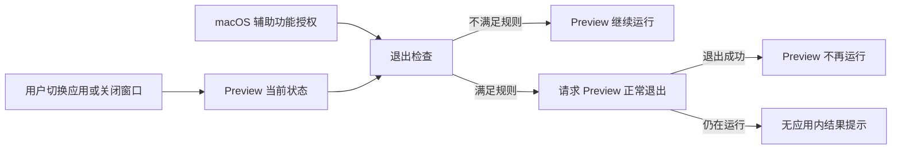

# 业务数据结构与流转

AutoQuit 使用 macOS 保存的辅助功能授权，并读取 Preview 当前是否运行、是否在前台和检查时的窗口列表。产品不保存用户设置、窗口历史、等待历史、退出结果或待处理任务。

## 数据主线

## 核心业务对象

### 辅助功能授权

- **用户相关数据**：AutoQuit 是否被 macOS 允许读取其他应用的辅助功能状态。
- **创建来源**：用户从 AutoQuit 请求系统授权，再在 macOS 辅助功能设置中开启权限。
- **更新入口**：macOS“系统设置 > 隐私与安全性 > 辅助功能”；AutoQuit 内没有授权开关。
- **主要消费者**：Preview 自动退出检查。
- **删除影响**：用户撤销后，AutoQuit 不请求 Preview 退出。
- **规则引用**：[`CTL-R-003`](modules/menu-bar-and-settings.md#ctl-r-003)、[`PAQ-R-005`](modules/preview-auto-quit.md#paq-r-005)

### Preview 当前状态

- **用户相关数据**：Preview 是否正在运行、是否在前台，以及退出检查时 macOS 返回的窗口列表。
- **创建来源**：用户启动 Preview、打开内容或切换到其他应用时形成当前状态。
- **更新入口**：用户启动或退出 Preview、切换应用、打开或关闭窗口；用户没有 AutoQuit 内的编辑入口。
- **主要消费者**：Preview 自动退出检查。
- **删除影响**：Preview 结束运行后不再接受检查；AutoQuit 不保留该次运行的历史。
- **规则引用**：[`PAQ-R-002`](modules/preview-auto-quit.md#paq-r-002)、[`PAQ-R-003`](modules/preview-auto-quit.md#paq-r-003)、[`PAQ-R-004`](modules/preview-auto-quit.md#paq-r-004)

## 自动退出判断流程

1. **输入**：macOS 辅助功能授权和 Preview 当前状态。
2. **权限结果**：权限缺失时停止本次判断；恢复入口见 [`PAQ-R-005`](modules/preview-auto-quit.md#paq-r-005)。
3. **读取与消费**：AutoQuit 在 Preview 离开前台超过 10 秒后的检查中读取当前窗口列表，并按 [`PAQ-R-003`](modules/preview-auto-quit.md#paq-r-003)、[`PAQ-R-004`](modules/preview-auto-quit.md#paq-r-004)、[`PAQ-R-007`](modules/preview-auto-quit.md#paq-r-007) 决定是否请求退出。
4. **用户结果**：Preview 退出或继续运行；AutoQuit 不显示结果，也不保存历史。

## 同步与外部集成

### macOS 辅助功能授权

1. 用户从“General > Click Me”请求 macOS 处理授权。
2. 用户在系统设置中授予或撤销权限；macOS 保存结果供 AutoQuit 读取。
3. AutoQuit 不上传、导出或跨设备同步该授权。

当前没有账号、导入、导出、云同步或其他外部数据集成。

## 删除与影响

### 撤销辅助功能授权

- **被删除或失效的数据**：AutoQuit 的 macOS 辅助功能授权。
- **下游影响**：AutoQuit 可以继续在菜单栏运行，但不请求 Preview 退出。
- **撤销入口**：重新打开 macOS“系统设置 > 隐私与安全性 > 辅助功能”并开启 AutoQuit。

### 退出 AutoQuit

- **被删除或失效的数据**：没有被删除的用户数据；当前应用状态读取和未完成等待停止。
- **下游影响**：自动退出停止；不会生成退出历史。
- **撤销入口**：重新启动 AutoQuit 后，从 Preview 当时的状态开始新的判断；之前的等待不会恢复。
