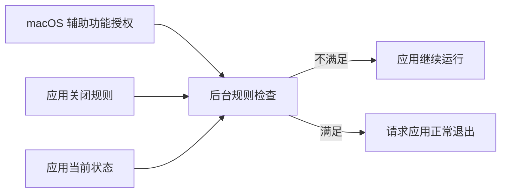

# 业务数据结构与流转

AutoQuit 使用 macOS 保存的辅助功能授权、用户为每个应用保存的关闭规则，以及应用当前的前台和窗口状态。产品不保存窗口历史、等待历史或退出结果。

## 数据主线

## 核心业务对象

### 辅助功能授权

- **用户相关数据**：AutoQuit 是否获得执行应用规则所需的 macOS 辅助功能权限。
- **创建来源**：用户从 General 发起请求，再在 macOS 中开启权限。
- **更新入口**：macOS“系统设置 > 隐私与安全性 > 辅助功能”。
- **主要消费者**：General 状态展示和所有 APP Rules 后台检查。
- **删除影响**：撤销后所有规则暂停，规则选择不会被删除。
- **规则引用**：[`GEN-R-002`](modules/menu-bar-and-settings.md#gen-r-002)、[`APP-R-007`](modules/app-rules.md#app-r-007)

### 应用关闭规则

- **用户相关数据**：应用标识和对应的“无条件关闭”或“无窗口关闭”选择；没有记录表示“不处理”。
- **创建来源**：用户在 APP Rules 中选择非默认条件。
- **更新入口**：每个应用行右侧的条件菜单。
- **主要消费者**：应用离开前台超过 10 秒后的后台判断。
- **删除影响**：改回“不处理”后，该应用不再收到 AutoQuit 的退出请求。
- **规则引用**：[`APP-R-002`](modules/app-rules.md#app-r-002)、[`APP-R-003`](modules/app-rules.md#app-r-003)、[`APP-R-010`](modules/app-rules.md#app-r-010)、[`APP-R-011`](modules/app-rules.md#app-r-011)

### 应用当前状态

- **用户相关数据**：应用是否正在运行、是否在前台，以及需要时 macOS 返回的窗口状态。
- **创建来源**：用户启动应用、切换应用或打开和关闭窗口时形成。
- **更新入口**：由应用的当前运行行为变化；AutoQuit 内没有编辑入口。
- **主要消费者**：10 秒等待和关闭条件判断。
- **删除影响**：应用结束运行后不再接受本次检查；AutoQuit 不保留历史。
- **规则引用**：[`APP-R-004`](modules/app-rules.md#app-r-004)、[`APP-R-005`](modules/app-rules.md#app-r-005)

## 应用规则生命周期

1. **发现**：AutoQuit 扫描应用目录并生成可选应用列表。
2. **创建或更新**：用户选择关闭条件；当前应用显示保存进度，保存成功后使用新条件。
3. **消费**：权限可用且应用离开前台超过 10 秒后，AutoQuit 读取规则和当前状态。
4. **用户结果**：应用继续运行或收到正常退出请求；结果不写入历史。
5. **删除**：用户把条件改回“不处理”，该应用的主动处理规则被移除。

加载失败时，规则列表停止编辑，后台按“不处理”执行，用户可以重新加载。保存失败时，原规则保持不变，失败的选择不会进入后续消费。

## 同步与外部集成

辅助功能授权由 macOS 保存；应用规则只保存在当前 Mac。当前没有账号、导入、导出、云同步或跨设备规则同步。

## 删除与影响

### 改回“不处理”

- **被删除或失效的数据**：目标应用的主动处理规则。
- **下游影响**：后续离开前台不再触发 AutoQuit 退出请求。
- **撤销入口**：重新选择“无条件关闭”或“无窗口关闭”。

### 撤销辅助功能授权

- **被删除或失效的数据**：AutoQuit 的系统授权；应用规则仍保留。
- **下游影响**：所有规则暂停。
- **撤销入口**：在 macOS 辅助功能设置中重新开启 AutoQuit。

### 退出 AutoQuit

- **被删除或失效的数据**：没有用户数据被删除；当前观察和未完成等待停止。
- **下游影响**：规则暂时不执行。
- **撤销入口**：重新启动 AutoQuit；已保存规则会恢复使用，但之前的等待不会继续。
