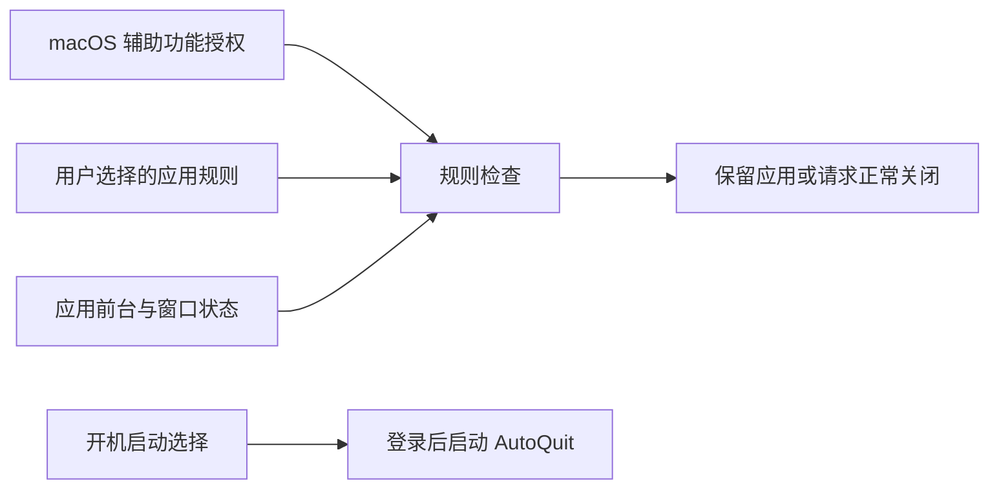

# AutoQuit 功能全景

> 适用版本：AutoQuit 1.1；macOS 26.0 及以上；基于 2026-08-09 的当前构建与运行行为。

AutoQuit 让用户为 Mac 中的应用分别设置关闭条件，并可选择在登录 Mac 后自动启动。应用离开前台超过 10 秒后，AutoQuit 按已保存的规则决定不处理、请求关闭，或仅在没有窗口时请求关闭。

## 立即开始

1. 启动 AutoQuit，在“General”确认辅助功能权限状态。
2. 如果显示未授权，点击“请求权限”，再在 macOS 中开启 AutoQuit。
3. 打开“APP Rules”，为目标应用选择关闭条件。
4. 让目标应用离开前台并保持超过 10 秒。

完成信号：规则菜单显示所选条件；满足规则的应用结束运行。AutoQuit 不显示关闭通知或操作历史。

## 功能模块

### General 与运行控制

用户目标：确认 AutoQuit 是否获得必要权限，选择是否随登录自动启动，并控制设置窗口或整个应用的运行状态。

入口与前置条件：手动启动 AutoQuit 后进入“General”；设置窗口关闭后可从菜单栏图标重新打开。权限由 macOS 管理。

该模块展示当前辅助功能权限状态，未授权时提供请求入口；“开机启动”控制 AutoQuit 是否在用户登录 Mac 后自动运行，登录项启动时只显示菜单栏图标；“软件更新”区域和菜单栏的“Check for Updates…”用于检查并安装新版本；关闭设置窗口后 AutoQuit 继续运行，选择“Quit”才会停止。

[查看 General 与运行控制详情](modules/menu-bar-and-settings.md)

### APP Rules

用户目标：从本机应用列表中找到目标应用，并为每个应用独立设置关闭条件。

入口与前置条件：设置窗口 > “APP Rules”；规则可以随时选择并立即保存，实际关闭需要辅助功能权限和 AutoQuit 持续运行。

该模块提供搜索、刷新和三个完整选项：“不处理”（默认）、“无条件关闭”、“无窗口关闭”。

[查看 APP Rules 详情](modules/app-rules.md)

## 主要用户旅程

- [为一个应用设置自动关闭](journeys/configure-app-auto-quit.md)：从确认权限和选择应用开始，最终让该应用在满足所选条件后结束运行。
- [让 AutoQuit 登录后自动运行](journeys/start-autoquit-at-login.md)：从 General 开启“开机启动”，最终在下一次登录 Mac 后自动进入运行状态。

## 核心业务数据

- [辅助功能授权](data-flows.md#accessibility-authorization)：由 macOS 保存，供 General 展示并作为规则执行前提。
- [开机启动选择](data-flows.md#launch-at-login-setting)：由用户在 General 设置并交给 macOS 保存，决定登录后是否自动启动 AutoQuit。
- [应用关闭规则](data-flows.md#app-close-rules)：由用户在 APP Rules 中选择，保存在当前 Mac，供后台检查消费。
- [应用当前状态](data-flows.md#application-current-state)：来自正在运行的应用和窗口读取结果，不保存为历史。

## 数据如何连接功能

## 遇到卡点

按“权限一直显示未授权”“开机启动等待批准”“找不到应用”“规则已选但应用仍在运行”等可见症状，查看[用户摩擦点与恢复路径](friction-points.md)。

## 文档边界

应用列表来自当前 Mac 的系统、全局和用户应用目录。AutoQuit 不提供等待时间设置、强制退出、关闭通知、操作历史、规则同步或应用内反馈入口。
